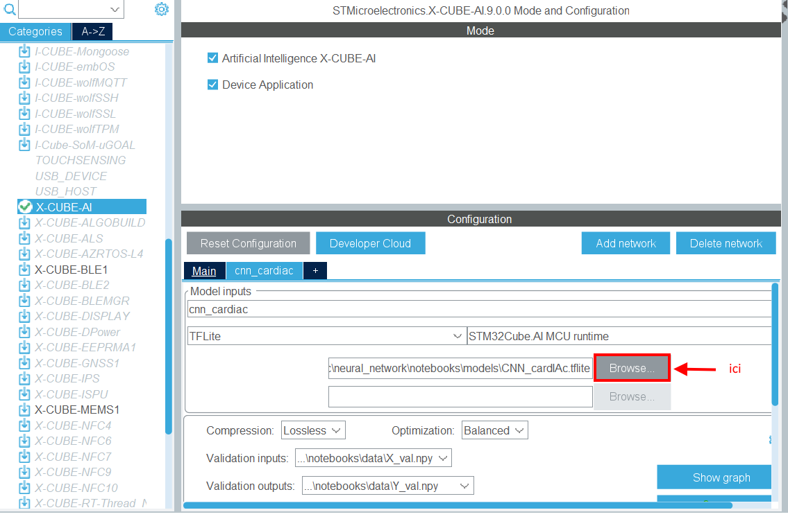

# Firmware cardIAc

Ce README décrit la génération et le test du firmware du projet. Il contient aussi une analyse du dimensionnement du microcontrôleur cible.

### Sommaire

- [Génération du firmware](./README.md#génération-du-firmware)
- [Test du firmware](./README.md#test-du-firmware)
- [Dimensionnement du microcontrôleur](./README.md#dimensionnement-du-microcontrôleur)

## Génération du firmware

La génération du firmware de ce projet se fait en utilisant CubeIDE. La version utilisée est *STM32CubeIDE v1.16.0*. 

### Modification du modèle utilisé

Pour changer le modèle chargé sur le microcontrôleur, il suffit d'ouvrir le `.ioc` du projet dans CubeIDE et de changer le modèle dans l'emplacement ci-dessous (format tflite pour éviter les problèmes de compatibilité).

A priori aucune modification autre n'est nécessaire tant que le modèle utilise les mêmes inputs/outputs.

## Test du firmware

Pour tester le modèle exécuter le programme `Test_STM32.py` qui se trouve dans le dossier `tests_serial` depuis la racine du projet (là où se trouve `.git`). 

Il faudra dans la plupart des cas modifier la variable `PORT` dans ce programme pour qu'elle corresponde a port série connectée avec la carte. 

## Dimensionnement du microcontrôleur

### Taille mémoire

La question au coeur de ce projet était le dimensionnement du microcontrôleur qui contient le réseau de neurones. 

Pour ce projet etait fournie une carte STM32L4R9 Discovery, qui a : 
- 2Mb de flash
- 640kb de RAM

Or le CNN utilise seulement 7.94kb de flash et 3.22kb de RAM. On a donc un microcontrôleur surdimensionné. On pourrait donc considérer des microcontrôleurs bien moins puissants (et moins chers) que celui-ci pour ce projet. 

### Temps d'inférence

Le temps d'inférence est lui aussi largement suffisant, malgré les 2 couches de convolution qui nécessitent beaucoup de calcul. En effet il n'y a jamais aucun problème à traiter une donnée entrante en moins de 100ms (temps d'attente du code python).

Ce temps, beaucoup plus rapide qu'un battement de coeur, est donc largement suffisant pour que le firmware soit intégré dans un système réel traitant des données temps réel. 
