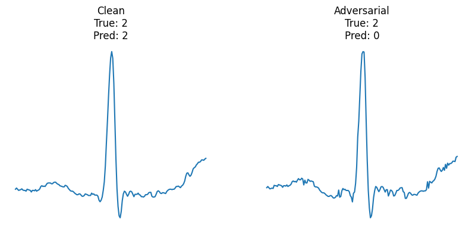
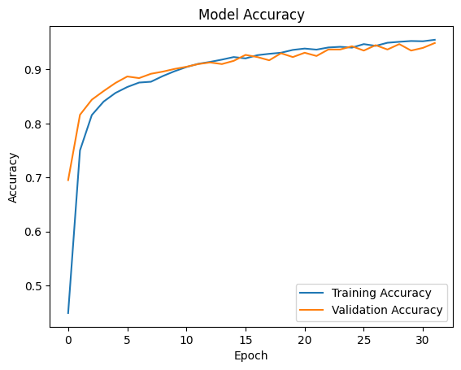
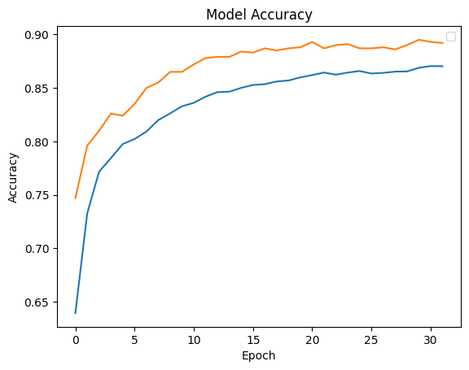

# Attaque adversarial

Le principe de l'attaque adversarial est de, connaissant le modèle utilisé pour la prédiction, modifier une donnée d'entrée de manière à induire le modèle en erreur.

Dans l'idéal, cette modification ne doit pas être détectable (le signal doit rester cohérent).

Par exemple on peut observer des modifications de ce type : 

## Implémentation

Une attaque adversarial a été effectuée sur le CNN de notre projet. Le code correspondant à cette attaque se trouve dans le notebook `CNN_adversarial` dans ce dossier.

Il suffit d'exécuter le code présent. La dernière cellule effectue une attaque adversarial paramétrable en utilisant la méthode *projected gradient descent*.

Afin d'entraîner un réseau de neurones avec ou sans protection contre ce type d'attaque, exécuter la cellule correspondante (visibles par le texte au dessus "Entraînement simple" ou "Entraînement avec protection contre adversarial").

## Protection contre les attaques adversarial

Il est possible de rendre les attaques adversarial sur un réseau de neurones plus difficiles simplement en l'attaquant pendant son entraînement. Le réseau de neurones peut alors apprendre à gérer ce type de modifications.

Il faut alors modifier l'entraînement du réseau de neurones pour include une attaque. Cependant cette approche est coûteuse car elle augmente le temps d'entraînement, et influence aussi la précision du réseau de neurones. 

On a par exemple sans attaque :

Et avec une attaque pendant l'entraînement : 

Cet entraînement est cependant très efficace, car sans lui les attaques adversarial peuvent très facilement faire chuter la précision du modèle en dessous de 50%, et avec lui l'attaque devient visible avant d'atteindre ce stade d'imprécisions.

